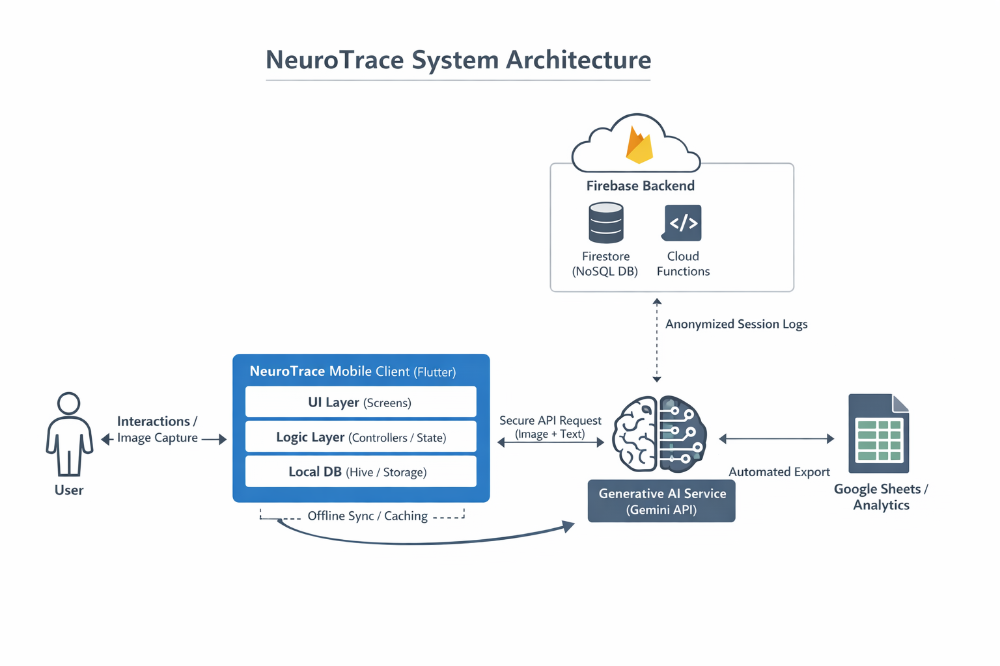
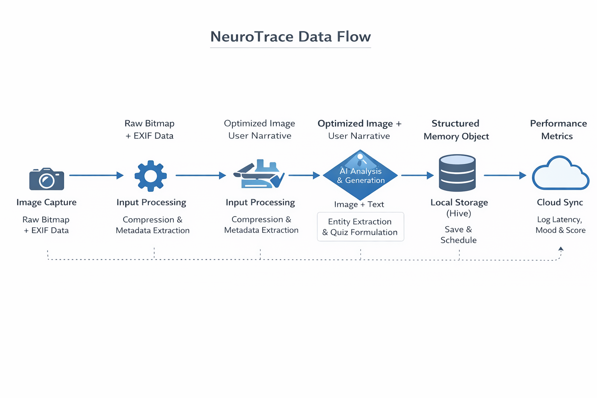
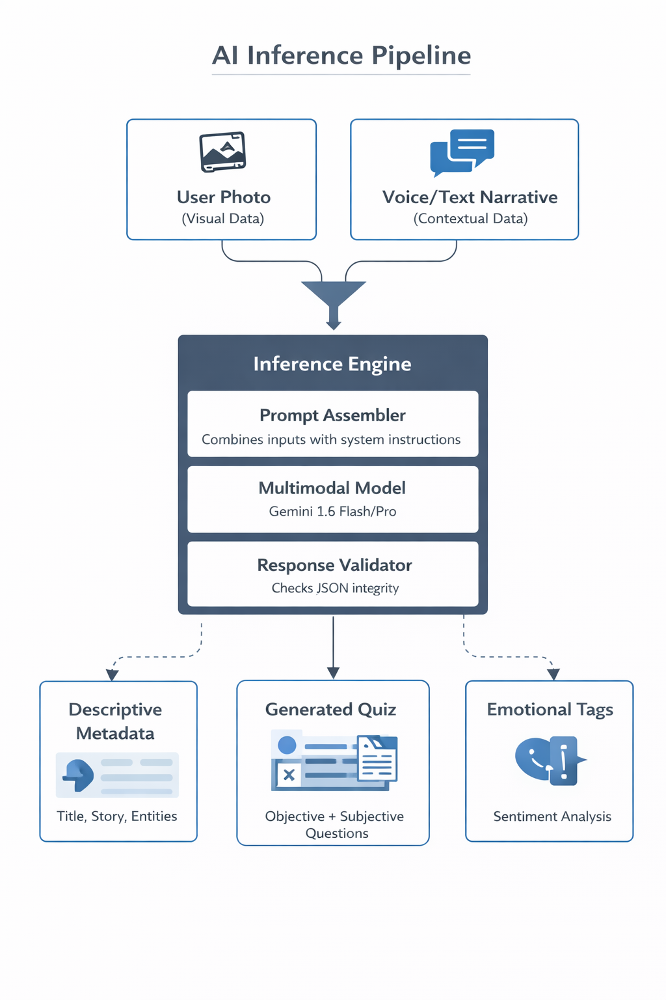
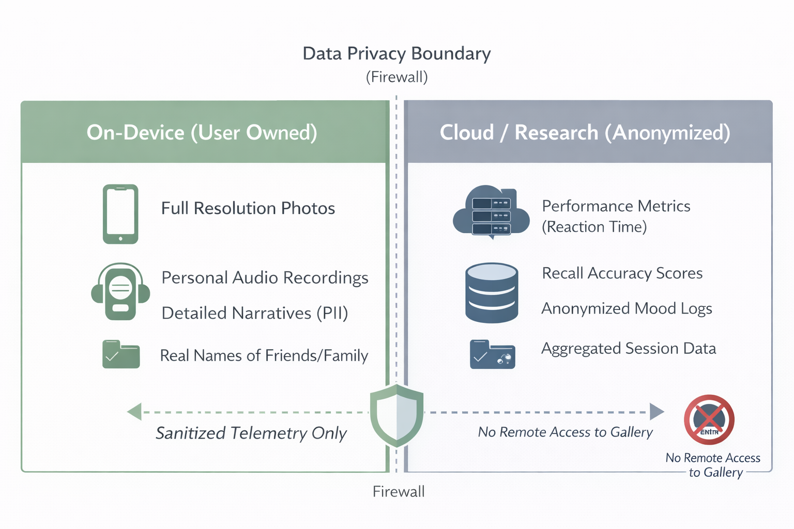

# NeuroTrace: AI-Powered Memory Support for Active Recall

  

## Current Status: Active Pilot Study
NeuroTrace is currently deployed in a supervised pilot study with a limited set of participants under faculty supervision. The study focuses on:
- **Engagement:** usage frequency and completion of recall sessions
- **Emotional signals:** pre/post recall mood ratings (EMA-style prompts)
- **System latency:** reducing perceived wait time across on-device + cloud steps

**Privacy note:** Because the study is active and privacy/IRB constraints apply, the production source code and all participant data remain private. This repository is a **technical architecture showcase** only.

---

## The Problem
For many older adults, photos and cloud albums preserve memories but don’t actively support recall. Traditional “memory saving” is mostly **passive**.

**Goal:** convert personal memories into **active recall practice** using structured prompts, quizzes, and scheduled reviews over time.

---

## The Solution
NeuroTrace is a mobile system that turns user photos and narratives into personalized recall sessions using multimodal generative AI. The app produces a structured “memory object” and schedules reviews over time (spaced review concepts).

### Core Capabilities
1. **Capture + Context**
   - Photo + optional voice/text narrative
   - Lightweight processing (compression + metadata extraction)

2. **Active Recall**
   - Generates short, diverse quiz questions grounded in the user’s memory content
   - Tracks recall outcomes for personalization

3. **Emotional Signals (Optional)**
   - Captures brief mood ratings around recall sessions to study patterns over time

---

## System Architecture
NeuroTrace uses a hybrid **local + cloud** design to balance responsiveness, cost, and privacy.

- **Mobile Client (Flutter):** UI + state + local storage (Hive)
- **Generative AI Service (Gemini API):** multimodal analysis and quiz generation
- **Backend (Firebase):** authentication, Cloud Functions, and anonymized telemetry
- **Research Output:** automated export of sanitized analytics (e.g., Google Sheets / dashboards)

---

## Data Flow
A single memory moves through a linear pipeline from creation to review.

1. **Image Capture** → raw bitmap + EXIF
2. **Input Processing** → compression + metadata extraction
3. **AI Analysis & Generation** → entity extraction + quiz formulation
4. **Local Storage (Hive)** → save + schedule review
5. **Active Recall Session** → user completes quiz
6. **Cloud Sync (Anonymized)** → logs latency, mood ratings, and scores

---

## AI Inference Pipeline (Abstracted)
This diagram intentionally avoids exposing prompt text while still showing the design.

**Inputs**
- User Photo (visual)
- Voice/Text Narrative (context)

**Inference Engine**
- **Prompt Assembler:** combines inputs with system instructions (prompts not included in this repo)
- **Multimodal Model:** Gemini (Flash/Pro variants depending on use case)
- **Response Validator:** validates JSON structure and required fields

**Outputs**
- **Descriptive metadata:** title, story, entities
- **Generated quiz:** objective + subjective questions
- **Emotional tags:** sentiment-style labels (when enabled)

---

## Privacy & Data Boundaries
Privacy is enforced by design through strict local-only storage of sensitive media.

- **On-Device (User Owned):** photos, audio recordings, detailed narratives, real names (PII)
- **Cloud / Research (Anonymized):** session metrics (reaction time), recall scores, mood logs, aggregated session data
- **Boundary rule:** only **sanitized telemetry** crosses the boundary  
  **No remote access** to the user’s photo gallery or local files

---

## Tech Stack
- **Mobile:** Flutter (Dart), Hive (local NoSQL), Provider (state)
- **AI:** Gemini API (multimodal), speech-to-text (as needed)
- **Backend:** Firebase Auth, Firestore, Cloud Functions
- **Analytics:** Google Sheets / dashboards for sanitized exports

---

## Engineering Challenges Addressed
- **Latency + UX smoothness:** moved heavy local operations off the UI thread to prevent jank
- **Reliability:** JSON validation + retries/backoff patterns for flaky network or rate limits
- **Local-first behavior:** users can review previously created memories offline

---

## Author
**Mohamed Gallai**  
Researcher & Lead Developer  
[LinkedIn](https://www.linkedin.com/in/mohamed-gallai/)

